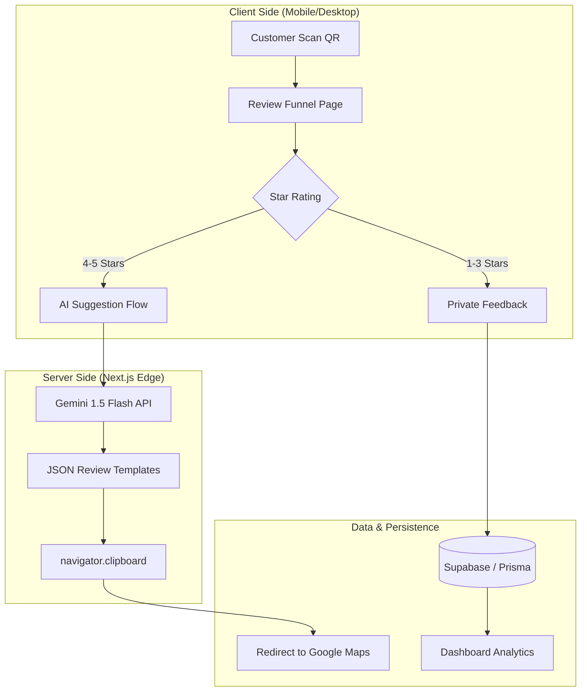

# ReviewClick AI — AI-Powered Reputation Management


## 1. Project Overview
ReviewClick AI is a high-performance reputation management platform designed to help physical businesses (restaurants, salons, clinics, etc.) skyrocket their Google Review count. By replacing static review links with an **AI-powered frictionless funnel**, it eliminates the "reviewer's block" that prevents customers from leaving feedback.

**The Problem:** Most customers *want* to help but find writing reviews time-consuming or difficult.  
**The Solution:** A 30-second QR-code-to-Google workflow that generates personalized, high-quality review templates based on the customer's specific experience.

> [!TIP]
> **One-Line Value Proposition:** Turn every customer scan into a 5-star Google Review machine using generative AI.

---

## 2. Live Demo & Visuals
- **Live Demo:** [https://reviewclick.vercel.app/](https://reviewclick.vercel.app/) (Placeholder)

| Dashboard Overview | AI Review Funnel | QR Manager |
|:---:|:---:|:---:|
|  |  |  |

---

## 3. Tech Stack & Choices

| Technology | Version | Why Chosen |
|:-----------|:--------|:-----------|
| **Next.js** | `16.2.4` | Used for its cutting-edge App Router, Server Components, and optimized rendering. |
| **React** | `19.2.4` | Leverages the latest React features for high-concurrency UI updates. |
| **Google Gemini AI** | `1.5 Flash` | Chosen for ultra-fast, low-latency generation of context-aware review templates. |
| **Prisma** | `7.8.0` | Type-safe ORM for robust data modeling and easy Supabase integration. |
| **Tailwind CSS** | `4.0` | Latest styling engine for high-performance, utility-first design. |
| **Clerk** | `^7.2.8` | Seamless, secure authentication and user management for businesses. |
| **Supabase (PG)** | `^2.105.1` | Reliable PostgreSQL hosting with real-time capabilities and storage. |
| **Radix UI** | `^1.1.15` | Accessible, unstyled primitives for building premium custom components. |
| **Recharts** | `^3.8.1` | Interactive data visualization for the business dashboard. |
| **Razorpay / Stripe** | `^2.9 / ^22` | Dual-provider support for global and Indian subscription billing. |

---

## 4. Feature Breakdown by Tool

### 🤖 Google Gemini AI (The Intelligence)
- **AI Review Generation**: Creates 4 distinct, natural-sounding review templates for every customer scan.
- **Sentiment-Based Routing**: Dynamically detects the "vibe" of the customer. 4-5 star reviews are encouraged to go public; 1-3 star reviews are routed to a private manager inbox.
- **Multi-Lingual Mastery**: Generates localized reviews in **English, Hindi, Tamil, Telugu, Kannada, Marathi, and Bengali**.
- **Context Awareness**: Injects business-specific keywords and Brand Names directly into the review body.

### 📊 Dashboard & Analytics (The Control Center)
- **Real-time Scan Tracking**: Uses `Prisma` to log every QR scan, tracking geolocation and time of visit.
- **Conversion Analytics**: Powered by `Recharts`, providing visual graphs of "Scan-to-Post" success rates.
- **Private Feedback Inbox**: A secure portal for managers to respond to 1-3 star reviews privately.

---

## 5. Project Structure

```text
.
├── prisma/
│   └── schema.prisma           # Database models & relationships (The "Source of Truth")
├── public/
│   └── favicon.ico             # App branding assets
├── src/
│   ├── app/
│   │   ├── api/                # Serverless API Endpoints
│   │   ├── dashboard/          # Business Portal (Stats, QR, Billing, Settings)
│   │   ├── onboarding/         # New business setup wizard
│   │   ├── r/                  # Public Review Funnel (The "Core Product")
│   │   ├── globals.css         # Tailwind 4 global styles
│   │   ├── layout.tsx          # Root layout & providers
│   │   └── page.tsx            # Marketing landing page
│   ├── lib/                    # Shared Core Logic
│   │   ├── gemini.ts           # Engine: AI prompt engineering (The "Brain")
│   │   ├── image-utils.ts      # Utils: Canvas & cropping logic
│   │   ├── plans.ts            # Config: Subscription tier definitions
│   │   ├── prisma.ts           # DB client singleton
│   │   ├── qr.ts               # Utils: QR generation logic
│   │   └── user-sync.ts        # Bridge: Clerk-to-Prisma sync logic
│   └── proxy.ts                # API Proxy utilities
├── next.config.ts              # Next.js configuration
├── package.json                # Project dependencies
└── tailwind.config.ts          # Styling configuration
```

### Key Directory Highlights

| Path | Purpose | Why it's Important |
|:-----|:--------|:-------------------|
| `prisma/schema.prisma` | **Database Schema** | Defines exactly how Users, Businesses, and Reviews are stored. |
| `src/app/r/[slug]` | **Public Funnel** | The mobile-first page that customers see after scanning the QR code. |
| `src/lib/gemini.ts` | **AI Logic** | Contains the core prompt engineering that makes the AI sound human. |
| `src/app/dashboard` | **Admin UI** | The complex management portal where businesses see their growth stats. |

---

## 6. System Architecture



## 7. State Management & Data Flow

### Global State
The project primarily utilizes **Next.js Server Components** for data fetching and **React State/Context** for client-side interactivity.
- **Clerk Context:** Manages global authentication state and user metadata.
- **Form State:** Heavy use of `useState` with validation for complex business configuration forms.

### Data Flow Walkthrough: The "Review Success" Action
1. **The Scan:** Customer scans the QR code, hitting `src/app/r/[slug]/page.tsx`.
2. **Interaction:** `ReviewFlow.tsx` captures a 5-star rating.
3. **AI Generation:** `handleGenerateSuggestions()` triggers a POST to `/api/suggestions`.
4. **Processing:** The API calls `generateReviewSuggestions` (in `gemini.ts`), feeding context into Gemini.
5. **The Post:** User taps "Copy & Post". `navigator.clipboard` stores the text, and `window.open` redirects to Google.

---

## 7. Technical Excellence: SEO & Performance

### 🔍 Dynamic SEO & Metadata
The platform uses Next.js `generateMetadata` for public review pages (`/r/[slug]`).
- **Dynamic OG Tags**: Automatically generates Open Graph titles using the Business Name.
- **Brand Identity**: Shared links appear with custom logos and compelling CTAs.

### ⚡ Performance Optimizations
- **Dynamic Imports**: Libraries like `html2canvas` are lazy-loaded only when needed, keeping the initial load under **200kb**.
- **AI Latency**: Gemini 1.5 Flash keeps review generation under **800ms**.

> [!NOTE]
> All public routes are server-side rendered (SSR) for maximum SEO and lightning-fast Time-to-Interactive (TTI).

---

## 8. Environment Configuration

To run this project, you will need to add the following variables to your `.env.local` file:

```env
# Database (Supabase)
DATABASE_URL="your_postgresql_url"

# Auth (Clerk)
NEXT_PUBLIC_CLERK_PUBLISHABLE_KEY=pk_test_...
CLERK_SECRET_KEY=sk_test_...

# AI (Google Gemini)
GEMINI_API_KEY=AIzaSy...

# Payments
NEXT_PUBLIC_RAZORPAY_KEY_ID=rzp_test_...
STRIPE_SECRET_KEY=sk_test_...
```

---

## 9. Getting Started

### Prerequisites
- Node.js 18+ & NPM/Bun
- A Supabase PostgreSQL instance

### Installation
1. **Clone & Install:**
   ```bash
   git clone https://github.com/your-username/reviewclick.git
   npm install
   ```

2. **Database Sync:**
   ```bash
   npx prisma generate
   npx prisma db push
   ```

3. **Run Dev:**
   ```bash
   npm run dev
   ```

---

## 10. Useful Developer Commands

| Command | Purpose |
|:--------|:--------|
| `npm run dev` | Start the development server. |
| `npx prisma studio` | GUI to manage local database records. |
| `npx prisma db push` | Sync schema with your database. |
| `npm run build` | Generate production bundle. |

---

## 11. Deployment

### Vercel (Recommended)
1. Add variables to Project Settings.
2. Build Command: `prisma generate && next build`.

### Supabase Storage
Create a public bucket named `business-assets` for logo uploads.

---

## 12. SaaS Roadmap & Vision

- [ ] **AI WhatsApp Automation**: Auto-follow-up via WhatsApp.
- [ ] **Sentiment Dashboard**: NLP analysis of feedback.
- [ ] **Multi-User Teams**: Staff access for store profiles.
- [ ] **Physical Standee Store**: Direct order for printed QR stands.
